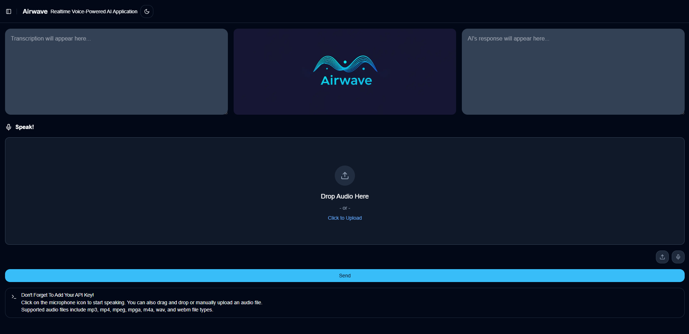

# AIrWave - Realtime Voice-Powered AI Application

## Overview

AIrWave is a high-performance, voice-powered AI application that leverages **Groq** for real-time speech recognition and text generation. Designed for seamless, low-latency interactions, AIrWave transforms spoken input into meaningful realtime speech recognition and text generation.

## Features

- **Realtime Speech Recognition**: Utilizes **Distil-Whisper English** powered by **Groq** to transcribe audio input with incredible accuracy.
- **Instant AI Responses**: Uses **Llama 3 70B** on **Groq** to generate quick and context-aware responses.
- **Modern Web Interface**: Built with **Next.js**, **TailwindCSS**, and **ShadCN** for a sleek and interactive user experience.
- **Backend Powered by Flask**: Handles API calls and integrates Groq’s AI models efficiently.

## Tech Stack

- **Frontend**: Next.js, TailwindCSS, ShadCN
- **Backend**: Flask
- **AI Models**: Distil-Whisper English (Speech-to-Text) & Llama 3 70B (Text Generation) powered by Groq

## Setup Instructions

### Prerequisites

- [Groq Cloud API Key](https://groq.com/) (Required for AI processing)
- Node.js & Python Installed
- Pip and Virtualenv for Python dependency management

### Installation

1. **Clone the Repository**
   ```sh
   git clone https://github.com/yourusername/airwave.git
   cd airwave
   ```
2. **Install Backend Dependencies**
   ```sh
   cd backend
   python -m venv venv
   source venv/bin/activate  # On Windows use `venv\Scripts\activate`
   pip install -r requirements.txt
   ```
3. **Install Frontend Dependencies**

   ```sh
   cd ../frontend
   npm install
   ```

4. **Set Up Environment Variables**
   Create a `.env` file in the backend directory and add:

   ```ini
   GROQ_API_KEY=your_groq_api_key
   ```

5. **Run the Backend Server**

   ```sh
   cd backend
   flask run
   ```

6. **Run the Frontend**
   ```sh
   cd frontend
   npm run dev
   ```

## Project Showcase



## Reference Material

This project is inspired by and references:
[Groq and Gradio for Realtime Voice-Powered AI Applications](https://github.com/groq/groq-api-cookbook/blob/main/tutorials/groq-gradio/groq-gradio-tutorial.ipynb)

## Contributing

Pull requests are welcome! For major changes, please open an issue first to discuss what you would like to change.

1. Fork the repository.
2. Create a new branch for your feature:
   ```bash
   git checkout -b feature/your-feature-name
   ```
3. Commit your changes:
   ```bash
   git commit -m "Added a new feature"
   ```
4. Push to the branch:
   ```bash
   git push origin feature/your-feature-name
   ```
5. Submit a pull request.

## License

This project is licensed under the MIT License - see the [LICENSE](LICENSE) file for details.
